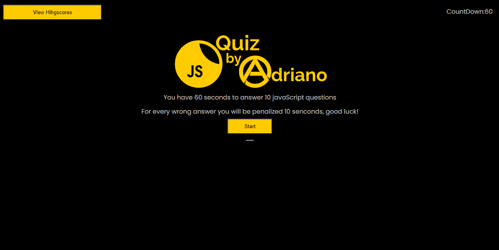

# adrianos-code-quiz-4

Homework 4 - Code Quiz

## HOMEWORK LINKS 🚀

* GitHub Repository [GitHub repository link](https://github.com/AdrianoArmen/adrianos-code-quiz-4) 

* Website Deployed [Website Deploy link](https://adrianoarmen.github.io/adrianos-code-quiz-4/) 

 ## Mock-Up 🔧

The following animation demonstrates the  desired application functionality:

## Project Description 📋
This sample app was designed to showcase my JavaScript knowledge by runing a simple interactive quiz. The app has a dark theme with yellow contrast to create a "JavaSripty" look. A custom logo header and instructions are displayed in the main section. Once the user clicks on START the quiz will begin. The user will have 60 seconds to answer a maximum of 10 questions about the coding language. Each time the user selects a wrong answer will be penalized by 10 seconds on his counter. If the countdown reaches 0 or all the 10 questions have been answered the app will allow the user to enter his/her initials that will be saved in local storage. Scores are measured by how many right answers did the user got out of the 10 questions. The app will display the higher scores at the top of the high scores section which you can access by a shortcut button on the top-left corner. The user also has the option to clear all saved High Scores and Go Back to try again the quiz.

## App Functionality 🛠️

The following animation demonstrates the actual application functionality:

## License 📄

This project is licensed under the MIT License - see the [LICENSE.md](LICENSE.md) file for details

---

© 2021 Adriano.

